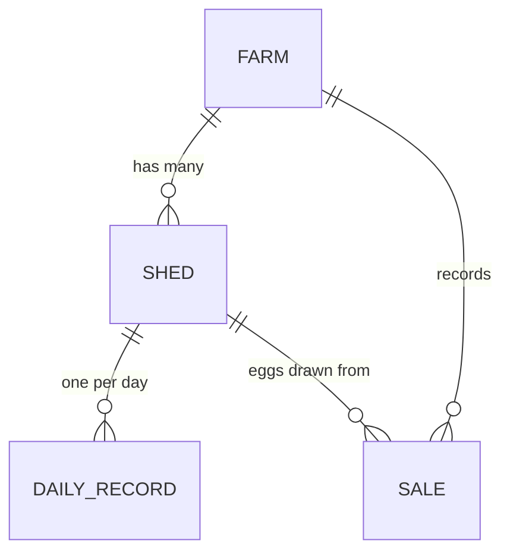

# Flockbook requirements — multi-shed model (v4)

Status: **specification, not yet built.** The code in `lib/farm.mjs` still
implements the single-flock v3 model. This document defines the target.

---

## 1. What changes and why

The prototype treats a farm as one flock: one bird count, one egg total, one
feed figure per day. A real farm runs several sheds of different sizes, holding
birds at different ages, and only some of them are laying at any time.

Rolling those together makes the headline numbers wrong, not just coarse:

- A shed of 8-week-old chicks contributes birds but no eggs, so a farm-wide
  laying rate silently collapses whenever a new batch is placed.
- Feed per dozen mixes grower feed with layer feed and means nothing.
- "5,200 birds" hides that one shed is over capacity and another is empty.

So the shed becomes the unit of record. The farm becomes a rollup.

---

## 2. Entities



### 2.1 Farm

One per workspace. Holds settings and membership only — no production figures.

| Field      | Type            | Notes                         |
| ---------- | --------------- | ----------------------------- |
| `name`     | string 1–80     |                               |
| `traySize` | int 1–100       | Eggs per tray, default 30     |
| `version`  | int             | `4`                           |
| `sample`   | bool            | Sample data flag              |
| `ownerUid` | string          | Immutable after creation      |
| `members`  | map uid to role | `owner` / `editor` / `viewer` |

Tray size is **no longer locked** once records exist — see section 4.

### 2.2 Shed

| Field                | Type             | Notes                                                |
| -------------------- | ---------------- | ---------------------------------------------------- |
| `id`                 | string           | Stable key                                           |
| `code`               | string 1–10      | Short label, e.g. `S1`, shown in tables              |
| `name`               | string 1–60      | e.g. "North layer shed"                              |
| `capacity`           | int >= 1         | Maximum birds the shed holds                         |
| `stage`              | ShedStage        | Current stage, see 2.3                               |
| `stageSince`         | date             | When the shed entered this stage                     |
| `notProducingReason` | Reason, optional | Required when stage is `not_producing`               |
| `notProducingNote`   | string <= 200    | Optional free text                                   |
| `openingBirds`       | int >= 0         | Strength before the first record                     |
| `openingEggs`        | int >= 0         | Egg stock before the first record                    |
| `breed`              | string <= 40     | Optional                                             |
| `placedOn`           | date, optional   | When the current batch was placed — drives flock age |
| `archived`           | bool             | Hidden from entry, kept for history                  |

**Current strength is never stored.** It is derived from `openingBirds` plus
intake minus deaths (3.1). Storing it invites two sources of truth that drift.

### 2.3 Shed stage

```
brooding          Chicks, 0 to ~8 weeks. No eggs.
growing           Growers / pullets, ~8 to 16 weeks. No eggs.
early_production  Beginning to lay, ~16 to 20 weeks. Rising output.
production        In full lay.
not_producing     Holding birds but not laying. Requires a reason.
empty             No birds. No eggs, no feed, no deaths.
```

`not_producing` reasons: `disease`, `moulting`, `old_age`, `cleaning`,
`between_batches`, `other`.

Stage drives validation, not just display. A shed in `brooding`, `growing`,
`not_producing` or `empty` must record **zero eggs** — this is the check that
catches the most common data entry error, putting one shed's eggs against
another shed.

### 2.4 Daily record

One per shed per day. Document id is `{shedId}__{date}`, which makes "one
record per shed per day" a structural guarantee rather than a client check.

| Field       | Type             | Notes                                          |
| ----------- | ---------------- | ---------------------------------------------- |
| `shedId`    | string           |                                                |
| `date`      | `YYYY-MM-DD`     | Not in the future                              |
| `stage`     | ShedStage        | Snapshot of the shed's stage that day          |
| `birds`     | int >= 0         | Counted strength                               |
| `deaths`    | int >= 0         | Deaths and culls                               |
| `added`     | int >= 0         | Birds brought in                               |
| `eggs`      | int >= 0         | **Canonical egg count**                        |
| `entry`     | `{ qty, unit }`  | What the user actually typed — `egg` or `tray` |
| `damaged`   | int >= 0         | Damaged / discarded eggs                       |
| `feedKg`    | number >= 0      | **Canonical feed in kilograms**                |
| `feedEntry` | `{ qty, unit }`  | `kg` or `tonne`                                |
| `notes`     | string <= 1000   |                                                |
| `updatedBy` | uid              | Audit                                          |
| `updatedAt` | server timestamp | Audit                                          |

### 2.5 Sale

| Field             | Type            | Notes                                     |
| ----------------- | --------------- | ----------------------------------------- |
| `id`              | string          |                                           |
| `date`            | `YYYY-MM-DD`    | Not in the future                         |
| `shedId`          | string          | **Which shed's stock the eggs came from** |
| `customer`        | string 1–100    |                                           |
| `eggs`            | int >= 1        | **Canonical egg count**                   |
| `entry`           | `{ qty, unit }` | `egg` or `tray`                           |
| `unitPriceMinor`  | int >= 1        | **Paise**, per tray or per egg            |
| `priceUnit`       | `tray` / `egg`  | Which unit the price is quoted in         |
| `discountPercent` | number 0–100    |                                           |
| `notes`           | string <= 1000  |                                           |

---

## 3. Derived figures

All of these are pure functions over the stored data. None are persisted.

### 3.1 Flock ledger (per shed)

```
strength(day) = openingBirds + sum(added) - sum(deaths)   up to and including day
```

Recorded `birds` is what a human counted. `strength` is what the log predicts.
The difference is reported as a variance, never rejected — a recount may
legitimately disagree, and forcing them equal destroys the signal.

`strength` may never go negative. `birds` may never exceed the shed's
`capacity`.

### 3.2 Egg ledger (per shed)

```
stock(day) = openingEggs + sum(eggs) - sum(damaged) - sum(eggs sold from this shed)
```

Never negative on any date, checked chronologically. Farm stock is the sum
across sheds.

Because stock is held per shed, **a sale draws from exactly one shed** and is
rejected if that shed cannot cover it on that date — even when the farm as a
whole holds enough. A customer buying more than one shed has in stock is
entered as one sale per shed.

**Splitting one order across sheds is deferred, deliberately.** If a customer
takes 100 trays and no single shed holds that much, enter one sale per shed.

This is safe to defer because it loses no information. Two sale entries record
the same facts as one two-line sale — same customer, date, price and eggs from
the same sheds — so a later migration can group them on customer, date and
price. The eventual change is mechanical: wrap each sale's `shedId` and `eggs`
into `lines: [{ shedId, eggs, entry }]`, and change the ledger filter from
`sales.filter(s => s.shedId === id)` to
`sales.flatMap(s => s.lines).filter(l => l.shedId === id)`. The only real work
is a sale dialog with repeatable rows, which that feature needs regardless.

Contrast with the decisions that genuinely cannot wait, because deferring them
destroys information rather than costing refactoring time: canonical eggs (the
tray size in force is unrecoverable afterwards), per-shed stock (unattributed
sales cannot be assigned later), `updatedBy` / `updatedAt` (unbackfillable),
and `placedOn` (flock age is unknowable without it).

### 3.3 Laying rate — the important one

```
layingRate = sum(eggs) / sum(bird-days of LAYING sheds only) * 100
```

Only records whose `stage` is `early_production` or `production` enter the
denominator. Including brooding or moulting birds produces a number that drops
whenever a healthy new batch arrives, which is the opposite of useful.

Report it per shed and as a farm rollup over laying sheds.

### 3.4 Other

| Metric               | Definition                                                 |
| -------------------- | ---------------------------------------------------------- |
| Feed per dozen       | `feedKg * 1000 / eggs * 12` grams, laying sheds only       |
| Mortality rate       | `deaths / average strength * 100`, per shed and per period |
| Capacity utilisation | `strength / capacity * 100`                                |
| Flock age            | `date - placedOn` in weeks, when `placedOn` is set         |

---

## 4. Units: egg / tray entry

Both production and sales accept quantities **in eggs or in trays**, and sale
prices **per egg or per tray**. The toggle applies per entry, not per farm.

The rule that makes this safe:

> Store the canonical value. Store what was typed. Never store a derived float.

- Quantities are stored as an integer **egg count**, alongside `entry: { qty, unit }`.
- Prices are stored as an integer **paise** value, alongside `priceUnit`.

Two consequences worth having:

1. **Tray size stops being destructive.** Today it is locked once records
   exist, because historical sales are stored in trays and changing the tray
   size would silently rewrite what was sold. With eggs canonical, past
   quantities are fixed and tray size becomes an ordinary display setting.
2. **Money stops drifting.** All arithmetic runs in integer paise with exactly
   one rounding step per sale.

### What is stored versus what is shown

Storage is canonical. Display is always in the unit the user chose. These are
never the same field.

| User types               | Stored                                          | Shown back       |
| ------------------------ | ----------------------------------------------- | ---------------- |
| `30` trays, tray size 30 | `eggs: 900`, `entry: { qty: 30, unit: 'tray' }` | `30 trays`       |
| `900` eggs               | `eggs: 900`, `entry: { qty: 900, unit: 'egg' }` | `900 eggs`       |
| `₹180.50` per tray       | `unitPriceMinor: 18050`, `priceUnit: 'tray'`    | `₹180.50 / tray` |
| `₹6.02` per egg          | `unitPriceMinor: 602`, `priceUnit: 'egg'`       | `₹6.02 / egg`    |

**Paise never reach the interface.** They are an internal representation only.
Every figure a user sees or types is in rupees, formatted `en-IN`.

`entry` exists so a record reads back exactly as it was written. A sale entered
as 30 trays shows "30 trays", not "900 eggs", unless the reader toggles the
display unit.

The tray size in force when a record was written stays recoverable without
being stored: for a tray entry it is `eggs / entry.qty`. So a sale made at 30
eggs per tray still reads "30 trays" after the farm switches to 12-egg trays,
because the 900 eggs it represents did not change.

### Aggregates

A period will mix tray-entered and egg-entered records, so totals cannot use
`entry`. They sum canonical `eggs` and present the farm's **current** tray size
as a convenience:

```
12,450 eggs (415 trays)
```

The egg count is authoritative. The tray figure is derived for readability and
may carry a remainder, which is shown rather than hidden.

### Sale amount

```
pricePerEggMinor = priceUnit === 'egg'
    ? unitPriceMinor
    : unitPriceMinor / traySize          // may be fractional, not yet rounded

grossMinor = round(eggs * pricePerEggMinor)
netMinor   = round(grossMinor * (1 - discountPercent / 100))
```

One rounding on gross, one on net. Discounts change value, never quantity.

---

## 5. Validation summary

Rejected outright:

- Egg stock negative for any shed on any date
- Flock strength negative for any shed on any date
- `birds` above the shed's `capacity`
- Eggs recorded against a shed whose stage is not `early_production` or `production`
- Any activity (eggs, feed, deaths, birds) against an `empty` shed
- `eggs` above `birds` for that shed and day
- Future dates; duplicate shed and date; unknown `shedId`
- Sale against a shed with insufficient stock on that date
- `not_producing` without a reason

Reported, not rejected:

- Counted `birds` differing from derived `strength`
- Capacity utilisation over ~95%
- Laying rate falling more than 10% week over week
- A shed sitting in `early_production` well past its expected age

---

## 6. Features to remove

Verified unused in this repo. Removing them cuts install size, review surface,
and the amount of code an agent has to read past.

| Remove                                                                                    | Why                                                                 |
| ----------------------------------------------------------------------------------------- | ------------------------------------------------------------------- |
| 43 of 60 files in `components/ui/`                                                        | Only 17 are imported anywhere                                       |
| `embla-carousel-react`, `cmdk`, `input-otp`, `react-day-picker`, `react-resizable-panels` | Referenced only by those unused UI files                            |
| `react-server-dom-webpack`, `vinext`, `date-fns`                                          | Zero references in source                                           |
| `@cloudflare/vite-plugin`, `@cloudflare/workers-types`, `wrangler`                        | Not deploying to Cloudflare; also drop from `tsconfig.json` `types` |
| `@openai/sites-vite-plugin`, `.openai/hosting.json`                                       | Not deploying to OpenAI sites                                       |
| `components/ui/chart.tsx`                                                                 | `page.tsx` imports `recharts` directly                              |
| `totals().revenue`                                                                        | Reads `r.price`, which records stopped carrying at v2 — dead since  |
| Demo login, `sessionStorage['flockbook.demo']`                                            | Replaced by Firebase Auth                                           |
| `hooks/use-farm-tools.ts` (WebMCP)                                                        | README records it as never verified against a supported context     |

Keep the v1 to v2 to v3 migration chain until pilot browsers are known to be
migrated; add v3 to v4 to it rather than replacing it.

---

## 7. Suggestions worth taking

Ordered by value, not effort.

1. **Batch-aware expectations.** With `placedOn`, flock age in weeks is known,
   and a standard lay curve for the breed turns "72% lay" into "72% at week 31,
   about 6 points under standard." This is the single most useful thing this
   data can tell a farmer, and it costs one date field per shed.
2. **A daily round entry flow.** Six sheds through a desktop dialog is six
   dialogs. Mobile needs one screen that walks shed to shed, remembering
   yesterday's figures as defaults.
3. **Audit fields now.** `updatedBy` / `updatedAt` on every record. Trivial to
   add today, impossible to reconstruct later, and section 3 of the roadmap
   already asks for it.
4. **Alerts over dashboards.** Mortality spike, production drop, over capacity,
   shed overdue to start laying. A farmer will not go looking in a chart.
5. **A `worker` role** that may only write today's records for assigned sheds —
   the common real case of farm staff doing data entry.
6. **Defer all finance.** Customer balances, invoices and payments are a phase
   of their own and should not be started until sheds are solid.
